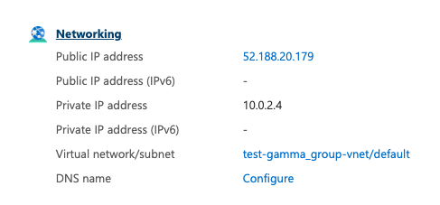

# Azure

1. Log into your Azure portal. \([https://portal.azure.com/](https://portal.azure.com/)\)
2. Click on the big plus \(Create a resource\)
3. In the "_Search the marketplace_" text box type in: "_Orbs_" and choose

    the entry "Orbs Gamma Development Blockchain Kit"

4. Click on Create
5. Choose the virtual machine name, region
6. Click on "_Review + Create_"  to get the machine setup unless you want to modify disk space or any other machine parameters.
7. On the summary page, make sure all is accurate and click "_Create_"
8. If you would like to access your Gamma server using ssh, Click on "_Download private key and create resource_". Otherwise, click "_Create_"
9. To obtain the public IP of the newly created VM, click on "_Go to resource_"

   The IP will be located on the "Networking" pane on the right side of the page under the property named: "_Public IP Address_" such as in the picture



You may now work with gamma server remotely. For more information on setting up a remote gamma environment on your local dev machine,  [click here](../working-with-multiple-environments.md#gamma-config-json)


```text
{
  "Environments": {
    "staging": {
      "VirtualChain": 42,
      "Endpoints": ["http://<ip>:8080"]
    }
  }
}
```


Prism block explorer will be available at `http://<ip>:3000/`

After setting up your Gamma remote environment, you can deploy your may [deploy first contract](../../getting-started/deploying-your-first-contract.md)

