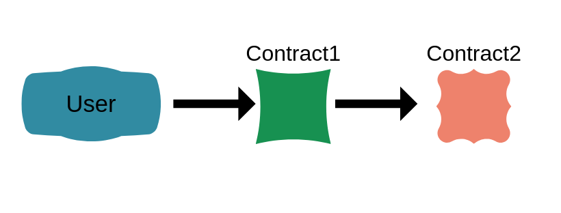

# Address

In Orbs, addresses are represented in hex values, and is the 20 least significant bytes of the _Sha256_ digest of the public key.

For example, the below is a valid address:

```text
0x4Bb4A3DA564983a3430602a7Bc2e82A8D012A875
```

Addresses or 'accounts' do not need to be created - the address is a simplified representation of the public key which is derived off the private key used to operate with the blockchain

The Orbs Contract SDK offers an API for working with address, in order to use it you need to import the address as such:

```go
import (
    "github.com/orbs-network/orbs-contract-sdk/go/sdk/v1/address"
)
```

### Checksum

Addresses are **case sensitive**, similarly to ethereum, the checksum is calculated according to the address in its case sensitive format and thus it is **always recommended** to use the address in that way. since everything is hex encoded, the underlying data does not change between the case status, meaning that an all lower-case, all upper-case and case-specific address of same letters, represent the same account, however the checksum can only be calculated correctly if the case sensitivity version of the address is presented

```text
// three addresses which are the same
0x4bb4a3da564983a3430602a7bc2e82a8d012a875
0X4BB4A3DA564983A3430602A7BC2E82A8D012A875
0x4Bb4A3DA564983a3430602a7Bc2e82A8D012A875 // this one is the correct case representation where a checksum can be validated
```

Having the ability to validate the checksum helps us make sure that in cases where human errors \(typos\) are made when inputting an address, we can alert and possibly reject the transaction \(depending on the selected logic\)

### Signer and caller

In Orbs there are two terms around well-known address during runtime, which are the Signer address and the Caller address.

The Signer address is the address of the account which is signing the transaction, in an ERC20 scenario for example, we will use that account to sign the transaction and transfer funds to/from it, depending on the operation.

The Caller address is the address of the entity that called the current function - while it may be the same as the signer address for simple scenarios, it can also be different, for example in the case where the contract calls a different contract



In the image above, the User calls contract one, at this stage:

* Signer: User
* Caller: User

Next, the logic of Contract1 will call Contract2, and at this stage when executing Contract2:

* Signer: User
* Caller: Contract1

### Address API

There is no Address native type, and addresses are referred to as `[]byte` internally in the code. This is why it is important to perform data validation to ensure that indeed the data in the `[]byte` matches a valid address format.

#### ValidateAddress

The API call `ValidateAddress` exists for that and can be used as such:

```go
ValidateAddress(address []byte)
```

As part of a code:

```go
func transfer(amount uint64, targetAddress []byte) {
	...
	// recipient
	address.ValidateAddress(targetAddress)
	...
}
```

If the validation fails, the execution will return an error, so there is no return value from this validation function

#### GetSignerAddress

In any function, calling `GetSignerAddress` will return the `[]byte` representation of the signer address

```go
GetSignerAddress() []byte
```

#### GetCallerAddress

In any function, calling `GetCallerAddress` will return the `[]byte` representation of the caller address

```go
GetCallerAddress() []byte
```

#### GetOwnAddress

In any function, calling `GetOwnAddress` will return the `[]byte` representation of the currently executing contract address

```go
GetOwnAddress() []byte
```

#### GetContractAddress

In any function, calling `GetContractAddress` will return the `[]byte` representation of the a specific contract address as specified in the argument

```go
GetContractAddress(contractName string) []byte
```

